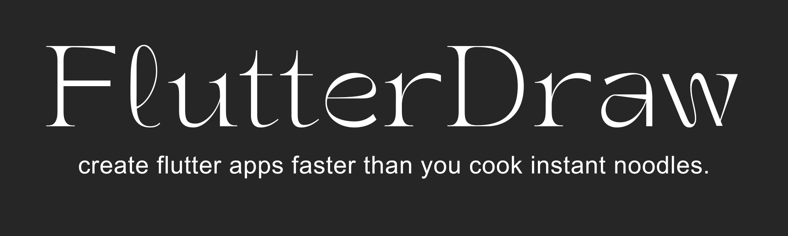
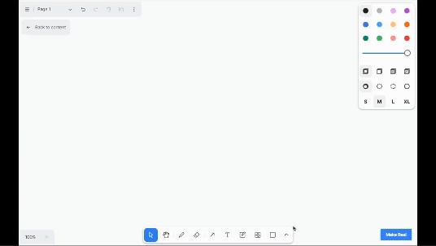

# FlutterDraw: Convert your Drawings into Flutter Apps



Welcome to FlutterDraw, an innovative application powered by the GPT Vision 4 API. This unique tool empowers users to sketch and design their Flutter applications on an online whiteboard and seamlessly convert these sketches into fully functional Flutter code with just one click.

## Features

- **Interactive Whiteboard:** Utilize an intuitive online whiteboard interface to sketch and draw your Flutter application layout and design.
- **GPT Vision 4 Integration:** Leverage the power of the GPT Vision 4 API for intelligent recognition and interpretation of your sketches.
- **One-Click Conversion:** Instantly convert your sketches into complete, runnable Flutter code with a single click.
- **Customization Options:** Fine-tune your designs and add specifications before conversion, including widget properties, layout configurations, and more.
- **Preview and Download:** Review a preview of your generated Flutter app and easily download the code for immediate use.

## Requirements

- Compatible web browser (Chrome, Firefox, Safari, etc.)
- Internet connectivity
- GPT-4 Vision Access Key

## Getting Started

Before getting started, make sure you have a version of Node.JS greater than 18.17 installed in your system. You can install Node.JS by [clicking here](https://nodejs.org/en/download). You can learn about Node.JS from [here](https://blog.dhruvbadaya.in/what-the-fck-is-nodejs-a-complete-tutorial).

To get started, follow the given steps:

- **Step 1:** Download the code for the repository by [clicking here](https://github.com/lightlessdays/FlutterDraw/archive/refs/tags/v1.zip).
- **Step 2:** Unzip the downloaded folder and open the folder in Visual Studio Code (or your favorite terminal).
- **Step 3:** Get your OPENAI GPT-4 Access Key and copy the following command:
  ```
  echo OPENAI_API_KEY=sk-your-key > .env.local
  ```
  Make sure to replace sk-your-key with your OPENAI key.
  This will create a new file called `$.env.local` in your folder.
- Once the command runs, enter the following command:
  ```
  npm install
  ```
  This command will install all the required NPM Packages for FlutterDraw.
- Lastly, run the following command:
  ```
  npm run dev
  ```
  This will start the FlutterDraw server. Once the server starts, go to your favorite browser and type in the URL `https://localhost:3000` or [click here](https://localhost:3000). This will take you to the FlutterDraw whiteboard, where you can start drawing.

## Demonstration



## API Key

To utilize the full functionality of FlutterDraw, ensure that you have obtained a valid API key for the GPT Vision 4 API. You can acquire an API key by signing up on the GPT Vision 4 platform and following the provided instructions.

## Contributing Guidelines

We welcome contributions from the community! Feel free to fork this repository, make changes, and submit pull requests to enhance the functionality and features of FlutterDraw.
